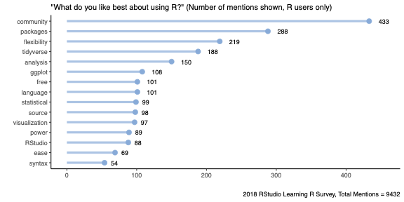

Bienvenidos a este e-Tutorial, en el que voy a cubrir porque deberías usar `R`, como instalarlo, y dar tus primeros pasos
[^fn-1] 


[^fn-1]: Aplican los "disclaimers" usuales. Si tenes comentarios, sugerencias, no dudes en enviarme un mensaje por `Slack`.

# ¿Qué es `R` y porqué usarlo?


`R` es un lenguaje gratuito, libre, de código abierto, y orientado a objetos. `R` no es un lenguaje de programación como `C` o `Java`. No fue creado para el desarrollo de software, sino que fue diseñado por estadísticos como un entorno interactivo para el análisis de datos. 


La interactividad es unas de sus características más importantes ya que nos permitirá explorar rápidamente los datos con los que estamos trabajando. Pero, además, dado que es un lenguaje de programación, al igual que otros lenguajes. uno puede guardar su trabajo en scripts que pueden ser ejecutables en cualquier momento
 
Al ser libre y de código abierto implica que cualquiera es libre de usar, redistribuir, y cambiarlo de cualquier forma. Es decir, que podemos no sólo usar las funciones que vienen en el software, sino que también crear propias, o utilizar las que otros investigadores, desarrolladores, y miembros de la comunidad idearon y pusieron a disposición en [CRAN] (http://cran.r-project.org), [github]( https://github.com/), u otros lugares.

Adicionalmente, `R`  esta extremadamente bien soportado, y la comunidad es genial. Si tiene una pregunta puede [googlearla](<http://www.google.com>), publicarla en [StackOverflow](<http://stackoverflow.com/>) o usar [R-bloggers ](<http://www.r-bloggers.com/>) . Es más, los usuarios habituales resaltan esto cuando se les pregunta como se puede ver en la gráfica de abajo.



Si aún no está convencido, simplemente escriba "por qué usar `R`" en [google](<http://www.google.com>), y creo que los resultados hablarán por sí mismos. 

Finalmente, y no menos importante, es gratuito y siempre lo será.


# Descargar e Instalar `R``

Podemos obtener una copia gratuita de `R` en [CRAN (Comprehensive R Archive Network)](<http://cran.r-project.org>) y eligiendo su sistema operativo. El siguiente  `.gif` ilustra como hacerlo a través de google:


Una vez descargado, siga las instrucciones para instalarlo.


# La Interface de `R` y `Rstudio`

Luego de descargar `R`, podemos trabajar al menos de dos formas: utilizando una interfaz gráfica o trabajando en `batch mode`. Pero dado que esto es una introducción dejaremos el `batch mode` para otro momento, y nos centraremos en las interfaces gráficas.  

Al usar `R` de forma interactiva o con scripts, puede usar una interfaz gráfica de usuario (GUI). LA distribución de `R` estándar viene con una interfaz gráfica lista para ser utilizada. Luego de instalar `R`, notará que creo un  acceso directo en su escritorio. Haciendo doble click en este podra usar la GUI.

Otra opción, y la que usaremos en el curso, es [RStudio](https://www.rstudio.com/), que también es gratuito y de código abierto. El siguiente  `.gif` ilustra como hacerlo a descargarlo con google:


# Primeros pasos en `R`

El siguiente paso es aprender la sintaxis de `R`, lo que significa aprender sus reglas. :uego de abrir el `RGUI` o [RStudio](https://www.rstudio.com/), verá la consola, que muestra los resultados de su análisis, o cualquier mensaje asociado con el código  ingresado en la línea de comando (después de la flecha `>`).

Por ejemplo, podemos usar `R` como calculadora, por ejemplo pruebe:


```r
    2 + 2
```

```
[1] 4
```

o


```r
    log(1)
```

```
[1] 0
```

El `[1]` indica que es el primer resultado del comando, y en este caso, el ùnico. Pero puede tambien ingresar algo son multiples valores, por ejemplo, una secuencia de enteros desde el 10 al 40:

 

```r
    10:40
```

```
 [1] 10 11 12 13 14 15 16 17 18 19 20 21 22 23 24 25 26 27 28 29 30 31 32 33 34
[26] 35 36 37 38 39 40
```

La primer linea inicia con el primer valor retornado, designado con `[1]`, la segunda linea comienza con el 26vo, designado con `[26]`.


Para salir de su seción puede escribir simplemente o cerrar [RStudio](https://www.rstudio.com/):


```r
    q()
```


# Paquetes de `R`


Cuando instalamos `R` sus funciones básica si bien podersas solo reflejan una pequeña fracción de lo que es posible hacer en `R`. Es mas, nos referimos a estas funciones como `base R`. La funcionalidades adicionales vienen dadas por paquetes.

Un paquete junta código, datos, documentación y pruebas, de forma tal que es fácil de compartir con otros. En `R`, uno puede compartir código a través de estos paquetes. 

En octubre de 2021, hay más de 18,300 paquetes disponibles [CRAN](<http://cran.r-project.org>). Esta enorme variedad de paquetes es una de las razones por las que `R` tiene tanto éxito: lo más probable es que alguien ya haya resuelto un problema en el que estamos trabajando y por lo tanto podemos beneficiarnos de su trabajo descargando su paquete. Por ejemplo, yo he creado dos paquetes: [RATest](https://cran.r-project.org/web/packages/RATest/index.html) e [ioanalysis](https://cran.r-project.org/web/packages/ioanalysis/)

En este curso utilizaremos varios paquetes, los principales serán [tidyverse](https://www.tidyverse.org/), [tidymodels](https://www.tidymodels.org/), y [caret](https://cran.r-project.org/web/packages/caret/index.html). Para instalar un paquete utilizamos la función `install.packages()`


```r
install.packages("tidyverse")
```

En [RStudio](https://www.rstudio.com/), tambiee2én puede hacerlo en la pestaña de `Tools`. 

Una vez instalado hay que llamarlo o cargarlo con la función


```r
library(tidyverse)
```

Una vez instalados no es necesario volverlos a instalar pero si cargarlos cuando vamos a utilizarlos. Recordemos, también que los paquetes estan instalados en `R` (el motor), y no en [RStudio](https://www.rstudio.com/) (la interface).

Finalmente, podemos ver todos los paquetes que tenemos isntalados con la función:

```r
installed.packages()
```


# Proximos pasos

En la primer clase veremos con mas profundidad como trabajar en `R`. Si tiene preguntas o problemas instalando, no dude en enviarme un `Slack`.


