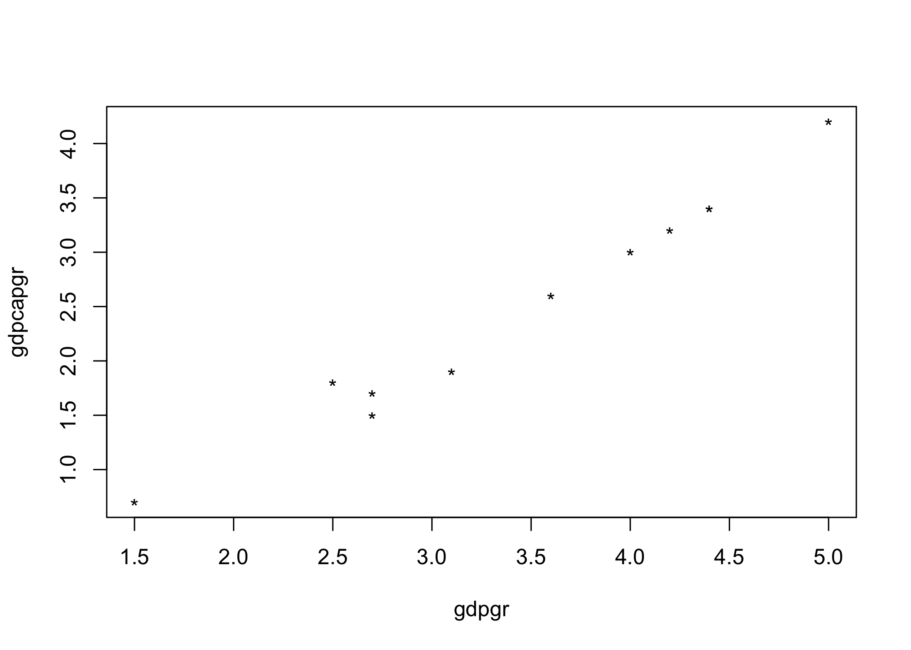
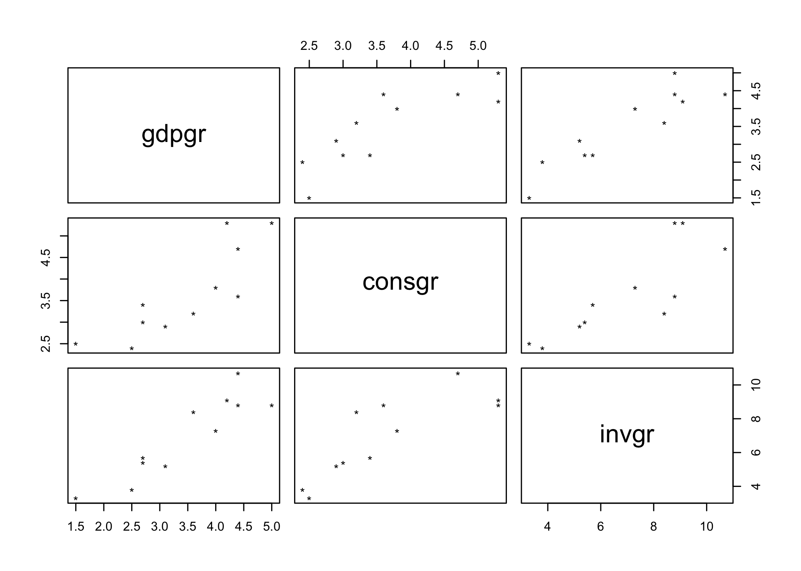
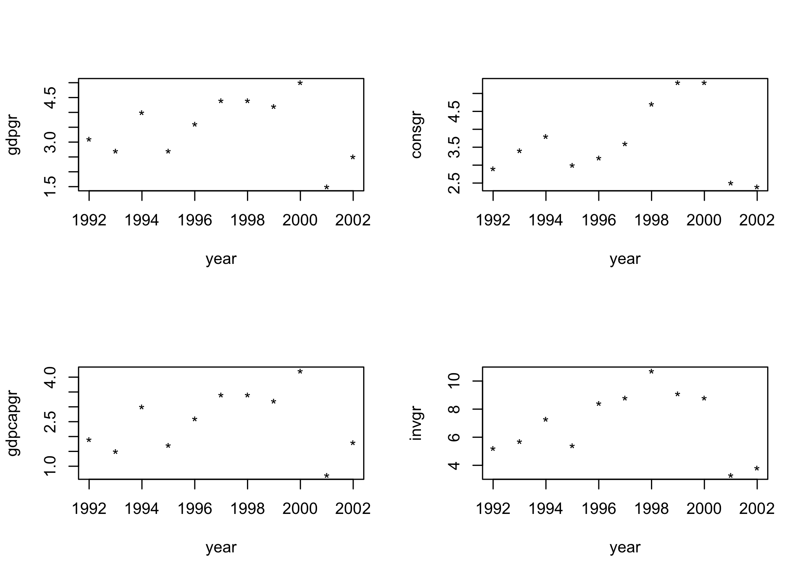
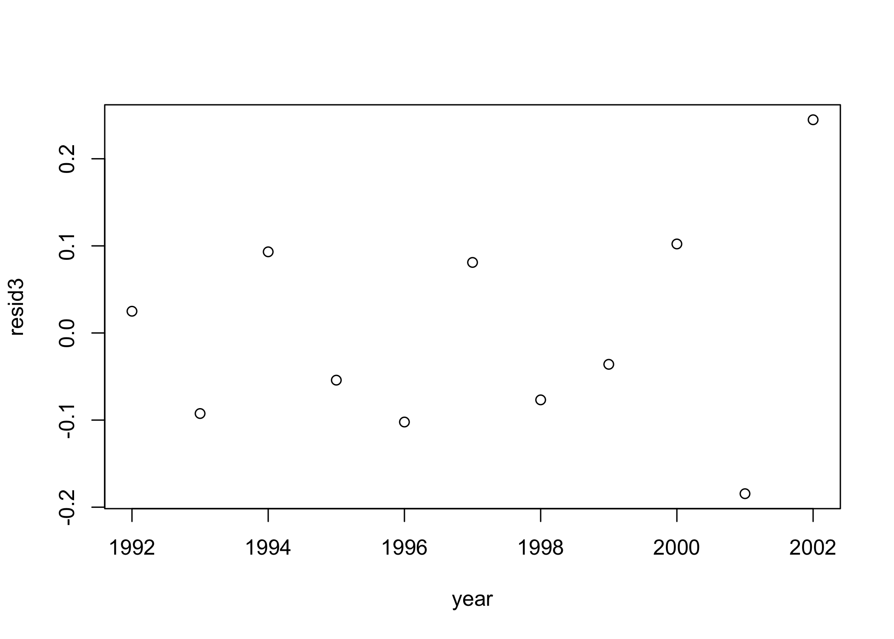
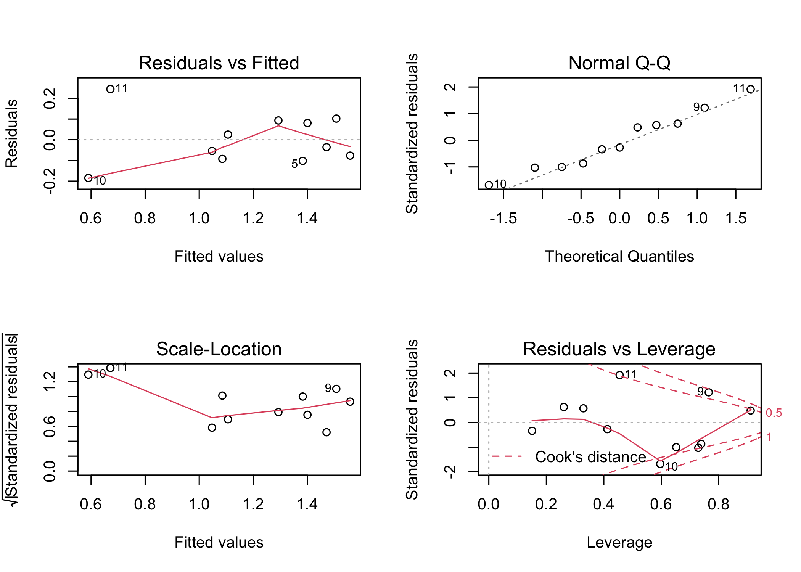
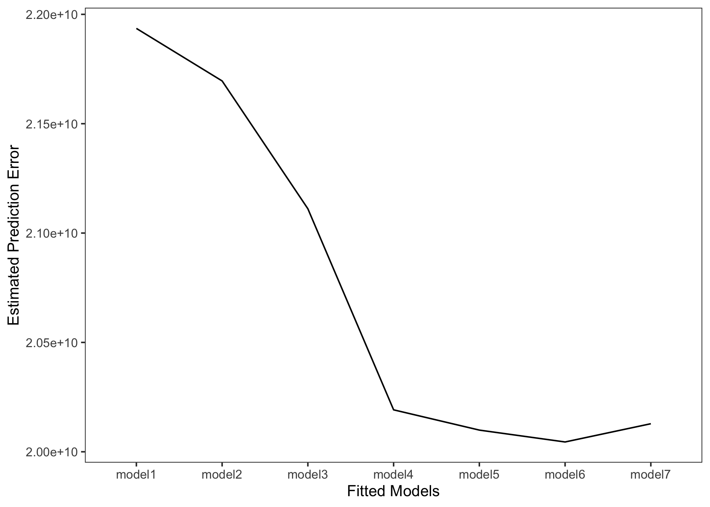

Welcome to e-Tutorial, your on-line help to ECON 4676. The present issue focuses on the basic operations of `R`. The core material was extracted from e-TA's at [Econ 508 of the University of Illinois](http://www.econ.uiuc.edu/~econ508/e-ta.html), and the book "A first course in statistical programming with R" by W. John Braun, Duncan J. Murdoch. . The usual disclaimers apply. [^fn-1] 


[^fn-1]: If you have comments, suggestions, etc. please submit a pull request ;).

# What's R and why use it?

R is a free, open-source, and object oriented language. Free and open-source means that anyone is free to use, redistribute and change the software in any way. Moreover, "R is "GNU S", a freely available language and environment for statistical computing and graphics which provides a wide variety of statistical and graphical techniques" (<http://cran.r-project.org>)

There are lot of software out there to do data analysis that are prettier and seem easier than R, so why should I invest learning R. First, of all R is an investment, not a waste of time. There are three characteristics of R that make it worthwhile learning it. First of all, it is free. Many fancier looking software used today are quite expensive, but R is free and is going to be free always. R also is a language, which means is that you don't only get to use the functions that are build in the software but you can create your own (just to get an overview of the power of the R language  you can take a look Professor [Koenker's Quantile Regression](<http://cran.r-project.org/web/packages/quantreg/index.html>) package). The last reason is that R is extremely well supported. If you have a question you just can [google](<http://www.google.com>) it, post it to [StackOverflow](<http://stackoverflow.com/>) or use [R-blogger](<http://www.r-bloggers.com/>). If you are not convinced yet, just can type "why use the R language"" in Google and I think the results will speak by themselves.

# Downloading and Installing R 
You can obtain a free copy of R CRAN (Comprehensive R Archive Network) on the web, by clicking  <http://cran.r-project.org> and choosing your appropriate operating system.


## The R Interface
After downloading R you can work at least in two ways with R, by using the graphical interface or working in *batch* mode. Since this is an introductory material to R and you are reading it, it is very likely that you will be using a graphical interface, so we'll center the e-TA's around that. After you have mastered the art of scripting in R or if you are brave enough you can try running your scripts in R batch mode.

### Rstudio
When using R interactively, or also with scripts, you can use the graphical user interface (GUI). There are at least two options to work this way with R. The first option comes straight out of the standard R installation. You can get access to it by clicking in the R icon installed in your desktop. 
The second option is to use [RStudio](<http://www.rstudio.com/>), which is also free and open sourced. I'll use [RStudio](<http://www.rstudio.com/>) in this class.


#First steps in R
Having installed R the next step is learning the *syntax* of the language, this means learning the rules of it.
After you open R GUI or R Studio you are going to see the R console, which displays the results of your analysis or any messages associated with your code that is entered in the command line (after the arrow ">"). 

For example, we can use R as a calculator. You can type arithmetical expressions at the prompt (">"):


```r
    2 + 2
```

```
[1] 4
```

or


```r
    log(1)
```

```
[1] 0
```

The [1] indicates that it is the first result from the command, and in this case the only one. You can also type something  with multiple values for example a sequence of integers from 10 to 40: 
 
 

```r
    10:40
```

```
 [1] 10 11 12 13 14 15 16 17 18 19 20 21 22 23 24 25 26 27 28 29 30 31 32 33 34
[26] 35 36 37 38 39 40
```

The first line starts with the first return value, so is labeled [1]; the second line starts with the 24th, so is labeled [24].


To quit you session just type


```r
    q()
```


## Scripting your work
Rather than saving the work space, it is highly recommended that you keep a record of the commands entered, so that we can reproduce it at a later date. The easiest way to do this is to enter commands in R'??s script editor, available from the File menu. Commands are executed by highlighting them and hitting Ctrl-R. At the end of a session, save the final script for a permanent record of your work. You can also use any text editor to do so. 
In R Studio the script editor opens next to the console and the mechanics is the same. Commands are executed by highlighting them and hitting Ctrl-Enter.

A *script* is a text file that contains lines of R code that can be saved and use over and over again. This is the preferred method to save your work and guarantee reproducibility. To know more on reproducible research you should read Professor Koenker's [Reproducibility in Econometrics Research webpage](<http://www.econ.illinois.edu/~roger/repro.html>)

A useful tip to keep in mind is that everything that is written after a # sign is assumed to be a comment and is ignored by `R`.

## Assignment

R has a work space known as `global enviroment` where you can store your objects. For example, suppose we would like to store the calculation `log(2)` for future use. To do this type:
 

```r
    x <- log(2)
```


Now `x` holds the result of such operation. To see this type
    

```r
    x
```

```
[1] 0.6931472
```

Now we can use `x` to do any operations. For example


```r
    x+x
```

```
[1] 1.386294
```

```r
    x*x
```

```
[1] 0.480453
```

#Vectors

You can also enter vectors. The `c()` function creates a vector. For example:


```r
    weight <- c(65,45,67,78,56)
```

Creates a vector containing the numbers 65, 45, 67, 78 and 56. We can see the contented by typing


```r
    weight
```

```
[1] 65 45 67 78 56
```

You can also check the length of the vector


```r
   length(weight)
```

```
[1] 5
```

It is possible to do some arithmetic computations, for example multiply all elements by 3


```r
    weight*3
```

```
[1] 195 135 201 234 168
```

or calculate a simple formula like


```r
    height <- c(1.7,1.8,1.76,1.65,1.74)

    bmi <- weight/height^2

    bmi
```

```
[1] 22.49135 13.88889 21.62965 28.65014 18.49650
```

First that we created a new vector that contains heights, and then calculated the body mass index. Note that the division is done member wise.


# Matrices and Arrays

To arrange numbers in a matrix, we can use the matrix function


```r
    x<-matrix(1:12,nrow=3, ncol=4)
    x
```

```
     [,1] [,2] [,3] [,4]
[1,]    1    4    7   10
[2,]    2    5    8   11
[3,]    3    6    9   12
```

or we can create a sequence of numbers and assign dimensions to it


```r
    x <- 1:12
    x
```

```
 [1]  1  2  3  4  5  6  7  8  9 10 11 12
```

```r
    dim(x) <- c(3,4)
    x
```

```
     [,1] [,2] [,3] [,4]
[1,]    1    4    7   10
[2,]    2    5    8   11
[3,]    3    6    9   12
```

We can assign names to the rows. For example, we assign the three first letters


```r
    rownames(x) <- LETTERS[1:3]
    x
```

```
  [,1] [,2] [,3] [,4]
A    1    4    7   10
B    2    5    8   11
C    3    6    9   12
```

Another useful operations are: 


|Operator or Function| Description                                                           |
|:------------------:|-----------------------------------------------------------------------|
|`A * B`               | Element-wise multiplication                                           |
|`A %*% B`             | Matrix multiplication                                                 |
|`A %o% B`             | Outer product. AB'                                                    |
|`t(A)`                |  Transpose                                                            |
|`diag(x)`             | Creates diagonal matrix with elements of x in the principal diagonal  |
|`solve(A, b)`         | Returns vector x in the equation b = Ax (i.e., A-1b)                  |
|`solve(A)`            | Inverse of A where A is a square matrix.                              |
|`cbind(A,B,...)`      | Combine matrices(vectors) horizontally. Returns a matrix.             |
|`rbind(A,B,...)`      | Combine matrices(vectors) vertically. Returns a matrix.               |
|`rowMeans(A)`         | Returns vector of row means.                                          |
|`rowSums(A)`          | Returns vector of row sums.                                           |
|`colMeans(A)`         | Returns vector of column means.                                       |  
|`colSums(A)`          | Returns vector of column means.                                        | 

(taken from [Quick-R](<http://www.statmethods.net/advstats/matrix.html>))


# Indexing

Individual elements of an array can be referenced by the name of the array followed by the subscripts in square brackets, and separated by commas. For example:

```r
    x<-matrix(1:12,nrow=3,ncol=4)
    x[,1]
```

```
[1] 1 2 3
```
refers to the first column of x. 

```r
    x[1,]
```

```
[1]  1  4  7 10
```
and refers to the first row. If we type

```r
    x[,1:2]
```

```
     [,1] [,2]
[1,]    1    4
[2,]    2    5
[3,]    3    6
```
we get the first two columns of x. But if we type

```r
    x[,c(2,4)]
```

```
     [,1] [,2]
[1,]    4   10
[2,]    5   11
[3,]    6   12
```
we obtain the second and forth column of x. We can also subset using another vector, for example:

```r
    weight[height>1.7]
```

```
[1] 45 67 56
```
gets those elements in weight that have a corresponding element in height bigger than 1.7
  
  
---
# What is "tidy" data?

Resources:
- [Vignette](https://cran.r-project.org/web/packages/tidyr/vignettes/tidy-data.html) (from the **tidyr** package)
- [Original paper](https://vita.had.co.nz/papers/tidy-data.pdf) (Hadley Wickham, 2014 JSS)

--

</br>

Key points:
1. Each variable forms a column.
2. Each observation forms a row.
3. Each type of observational unit forms a table.

--

</br>

Basically, tidy data is more likely to be [long (i.e. narrow) format](https://en.wikipedia.org/wiki/Wide_and_narrow_data) than wide format.

---

# Checklist

☑ You should already have installed the [**tidyverse**](https://www.tidyverse.org/) in the first lecture.
- However, I also want you to install the development version of **dplyr**: `remotes::install_github('tidyverse/dplyr')`
- If the above command doesn't work for you, make sure that you've installed the [**remotes**](https://remotes.r-lib.org/) package first. Similarly, if you get a question about upgrading other packages, select "All" (normally option 1).
- I'll get back to this stuff later on in the lecture.

☑ You will also need the [**nycflights13**](hhttps://github.com/hadley/nycflights13) package.
- Install it now: `install.packages('nycflights13', repos = 'https://cran.rstudio.com')`

---


# Tidyverse basics

<html><div style='float:left'></div><hr color='#EB811B' size=1px width=796px></html>


# Tidyverse vs. base R

Much digital ink has been spilled over the "tidyverse vs. base R" debate.

--

I won't delve into this debate here, because I think the answer is [obvious](http://varianceexplained.org/r/teach-tidyverse/): We should teach the tidyverse first (or, at least, early).
- The documentation and community support are outstanding.
- Having a consistent philosophy and syntax makes it much easier to learn.
- The tidyverse provides a convenient "front-end" to some key big-data tools that we'll use later in the course.
- For data cleaning, wrangling and plotting... the tidyverse is really a no-brainer.<sup>1</sup>

.footnote[
<sup>1</sup> I'm also a huge fan of [**data.table**](http://r-datatable.com/). This package will be the subject of our next lecture...
]

--

But this certainly shouldn't put you off learning base R alternatives.
- Base R is extremely flexible and powerful, esp. when combined with other libraries.
- There are some things that you'll have to venture outside of the tidyverse for.
- A combination of tidyverse and base R is often the best solution to a problem.


One point of convenience is that there is often a direct correspondence between a tidyverse command and its base R equivalent. 

These generally follow a `tidyverse::snake_case` vs `base::period.case` rule. E.g. Compare:

| tidyverse  |  base |
|---|---|
| `?readr::read_csv`  | `?utils::read.csv` |
|  `?dplyr::if_else` |  `?base::ifelse` |
|  `?tibble::tibble` |  `?base::data.frame` |
Etcetera.
  
If you call up the above examples, you'll see that the tidyverse alternative typically offers some enhancements or other useful options (and sometimes restrictions) over its base counterpart.
- Remember: There are always many ways to achieve a single goal in R.

---

# Tidyverse packages

Let's load the tidyverse meta-package and check the output.

```r
library(tidyverse)
```

```
## ── Attaching packages ─────────────────────────────────────── tidyverse 1.3.1 ──
```

```
## ✓ ggplot2 3.3.5     ✓ purrr   0.3.4
## ✓ tibble  3.1.5     ✓ dplyr   1.0.7
## ✓ tidyr   1.1.3     ✓ stringr 1.4.0
## ✓ readr   1.4.0     ✓ forcats 0.5.1
```

```
## ── Conflicts ────────────────────────────────────────── tidyverse_conflicts() ──
## x dplyr::filter() masks stats::filter()
## x dplyr::lag()    masks stats::lag()
```


We see that we have actually loaded a number of packages (which could also be loaded individually): **ggplot2**, **tibble**, **dplyr**, etc.
- We can also see information about the package versions and some [namespace conflicts](https://raw.githack.com/uo-ec607/lectures/master/04-rlang/04-rlang.html#59).


The tidyverse actually comes with a lot more packages than those that are just loaded automatically.<sup>1</sup>

```r
tidyverse_packages()
```

```
##  [1] "broom"         "cli"           "crayon"        "dbplyr"       
##  [5] "dplyr"         "dtplyr"        "forcats"       "googledrive"  
##  [9] "googlesheets4" "ggplot2"       "haven"         "hms"          
## [13] "httr"          "jsonlite"      "lubridate"     "magrittr"     
## [17] "modelr"        "pillar"        "purrr"         "readr"        
## [21] "readxl"        "reprex"        "rlang"         "rstudioapi"   
## [25] "rvest"         "stringr"       "tibble"        "tidyr"        
## [29] "xml2"          "tidyverse"
```

We'll use several of these additional packages during the remainder of this course.
— E.g. The **lubridate** package for working with dates and the **rvest** package for webscraping.
- However, bear in mind that these packages will have to be loaded separately.

.footnote[
<sup>1</sup> It also includes a *lot* of dependencies upon installation. This is a topic of some [controversy](http://www.tinyverse.org/).
].


I hope to cover most of the tidyverse packages over the length of this course.

Today, however, I'm only really going to focus on two packages: 
1. [**dplyr**](https://dplyr.tidyverse.org/)
2. [**tidyr**](https://tidyr.tidyverse.org/)

These are the workhorse packages for cleaning and wrangling data. They are thus the ones that you will likely make the most use of (alongside **ggplot2**, which we already met back in Lecture 1).
- Data cleaning and wrangling occupies an inordinate amount of time, no matter where you are in your research career.

---

# An aside on pipes: %>%

We already learned about pipes in our lecture on the bash shell. In R, the pipe operator is denoted `%>%` and is automatically loaded with the tidyverse.
  
I want to reiterate how cool pipes are, and how using them can dramatically improve the experience of reading and writing code. Compare:


```r
## These next two lines of code do exactly the same thing.
mpg %>% filter(manufacturer=="audi") %>% group_by(model) %>% summarise(hwy_mean = mean(hwy))
summarise(group_by(filter(mpg, manufacturer=="audi"), model), hwy_mean = mean(hwy))
```

--

The first line reads from left to right, exactly how I thought of the operations in my head. 
- Take this object (mpg), do this (filter), then do this (group by), etc.

The second line totally inverts this logical order (the final operation comes first!) 
- Who wants to read things inside out?


The piped version of the code is even more readable if we write it over several lines. Here it is again and, this time, I'll run it for good measure so you can see the output:


```r
mpg %>% 
  filter(manufacturer=="audi") %>% 
  group_by(model) %>% 
  summarise(hwy_mean = mean(hwy))
```

```
## # A tibble: 3 × 2
##   model      hwy_mean
##   <chr>         <dbl>
## 1 a4             28.3
## 2 a4 quattro     25.8
## 3 a6 quattro     24
```

Remember: Using vertical space costs nothing and makes for much more readable/writeable code than cramming things horizontally.

--

PS — The pipe is originally from the [**magrittr**](https://magrittr.tidyverse.org/) package ([geddit?](https://en.wikipedia.org/wiki/The_Treachery_of_Images)), which can do some other cool things if you're inclined to explore.


</br>

P.S. See the original dplyr 1.0.0 announcement [here](https://www.tidyverse.org/blog/2020/03/dplyr-1-0-0-is-coming-soon/). The tidyverse blog is also running a series of posts on the new dplyr features (e.g. [here](https://www.tidyverse.org/blog/2020/04/dplyr-1-0-0-rowwise/)).

---

# Key dplyr verbs

There are five key dplyr verbs that you need to learn.

1. `filter`: Filter (i.e. subset) rows based on their values.

2. `arrange`: Arrange (i.e. reorder) rows based on their values.

3. `select`: Select (i.e. subset) columns by their names: 

4. `mutate`: Create new columns.

5. `summarise`: Collapse multiple rows into a single summary value.<sup>1</sup>

.footnote[
<sup>1</sup> `summarize` with a "z" works too. R doesn't discriminate against uncivilised nations of the world.
]

--

</br>

Let's practice these commands together using the `starwars` data frame that comes pre-packaged with dplyr. 

---

# 1) dplyr::filter

We can chain multiple filter commands with the pipe (`%>%`), or just separate them within a single filter command using commas.

```r
starwars %>% 
  filter( 
    species == "Human", 
    height >= 190
    ) 
```

```
## # A tibble: 4 × 14
##   name      height  mass hair_color skin_color eye_color birth_year sex   gender
##   <chr>      <int> <dbl> <chr>      <chr>      <chr>          <dbl> <chr> <chr> 
## 1 Darth Va…    202   136 none       white      yellow          41.9 male  mascu…
## 2 Qui-Gon …    193    89 brown      fair       blue            92   male  mascu…
## 3 Dooku        193    80 white      fair       brown          102   male  mascu…
## 4 Bail Pre…    191    NA black      tan        brown           67   male  mascu…
## # … with 5 more variables: homeworld <chr>, species <chr>, films <list>,
## #   vehicles <list>, starships <list>
```


Regular expressions work well too.

```r
starwars %>% 
  filter(grepl("Skywalker", name))
```

```
## # A tibble: 3 × 14
##   name     height  mass hair_color skin_color eye_color birth_year sex    gender
##   <chr>     <int> <dbl> <chr>      <chr>      <chr>          <dbl> <chr>  <chr> 
## 1 Luke Sk…    172    77 blond      fair       blue            19   male   mascu…
## 2 Anakin …    188    84 blond      fair       blue            41.9 male   mascu…
## 3 Shmi Sk…    163    NA black      fair       brown           72   female femin…
## # … with 5 more variables: homeworld <chr>, species <chr>, films <list>,
## #   vehicles <list>, starships <list>
```


A very common `filter` use case is identifying (or removing) missing data cases. 

```r
starwars %>% 
  filter(is.na(height))
```

```
## # A tibble: 6 × 14
##   name     height  mass hair_color skin_color eye_color birth_year sex    gender
##   <chr>     <int> <dbl> <chr>      <chr>      <chr>          <dbl> <chr>  <chr> 
## 1 Arvel C…     NA    NA brown      fair       brown             NA male   mascu…
## 2 Finn         NA    NA black      dark       dark              NA male   mascu…
## 3 Rey          NA    NA brown      light      hazel             NA female femin…
## 4 Poe Dam…     NA    NA brown      light      brown             NA male   mascu…
## 5 BB8          NA    NA none       none       black             NA none   mascu…
## 6 Captain…     NA    NA unknown    unknown    unknown           NA <NA>   <NA>  
## # … with 5 more variables: homeworld <chr>, species <chr>, films <list>,
## #   vehicles <list>, starships <list>
```


To remove missing observations, simply use negation: `filter(!is.na(height))`. Try this yourself.


# 2) dplyr::arrange


```r
starwars %>% 
  arrange(birth_year)
```

```
## # A tibble: 87 × 14
##    name     height  mass hair_color skin_color eye_color birth_year sex   gender
##    <chr>     <int> <dbl> <chr>      <chr>      <chr>          <dbl> <chr> <chr> 
##  1 Wicket …     88  20   brown      brown      brown            8   male  mascu…
##  2 IG-88       200 140   none       metal      red             15   none  mascu…
##  3 Luke Sk…    172  77   blond      fair       blue            19   male  mascu…
##  4 Leia Or…    150  49   brown      light      brown           19   fema… femin…
##  5 Wedge A…    170  77   brown      fair       hazel           21   male  mascu…
##  6 Plo Koon    188  80   none       orange     black           22   male  mascu…
##  7 Biggs D…    183  84   black      light      brown           24   male  mascu…
##  8 Han Solo    180  80   brown      fair       brown           29   male  mascu…
##  9 Lando C…    177  79   black      dark       brown           31   male  mascu…
## 10 Boba Fe…    183  78.2 black      fair       brown           31.5 male  mascu…
## # … with 77 more rows, and 5 more variables: homeworld <chr>, species <chr>,
## #   films <list>, vehicles <list>, starships <list>
```


*Note.* Arranging on a character-based column (i.e. strings) will sort alphabetically. Try this yourself by arranging according to the "name" column.


We can also arrange items in descending order using `arrange(desc())`.

```r
starwars %>% 
  arrange(desc(birth_year))
```

```
## # A tibble: 87 × 14
##    name    height  mass hair_color skin_color  eye_color birth_year sex   gender
##    <chr>    <int> <dbl> <chr>      <chr>       <chr>          <dbl> <chr> <chr> 
##  1 Yoda        66    17 white      green       brown            896 male  mascu…
##  2 Jabba …    175  1358 <NA>       green-tan,… orange           600 herm… mascu…
##  3 Chewba…    228   112 brown      unknown     blue             200 male  mascu…
##  4 C-3PO      167    75 <NA>       gold        yellow           112 none  mascu…
##  5 Dooku      193    80 white      fair        brown            102 male  mascu…
##  6 Qui-Go…    193    89 brown      fair        blue              92 male  mascu…
##  7 Ki-Adi…    198    82 white      pale        yellow            92 male  mascu…
##  8 Finis …    170    NA blond      fair        blue              91 male  mascu…
##  9 Palpat…    170    75 grey       pale        yellow            82 male  mascu…
## 10 Cliegg…    183    NA brown      fair        blue              82 male  mascu…
## # … with 77 more rows, and 5 more variables: homeworld <chr>, species <chr>,
## #   films <list>, vehicles <list>, starships <list>
```


# 3) dplyr::select

Use commas to select multiple columns out of a data frame. (You can also use "first:last" for consecutive columns). Deselect a column with "-".

```r
starwars %>% 
  select(name:skin_color, species, -height)
```

```
## # A tibble: 87 × 5
##    name                mass hair_color    skin_color  species
##    <chr>              <dbl> <chr>         <chr>       <chr>  
##  1 Luke Skywalker        77 blond         fair        Human  
##  2 C-3PO                 75 <NA>          gold        Droid  
##  3 R2-D2                 32 <NA>          white, blue Droid  
##  4 Darth Vader          136 none          white       Human  
##  5 Leia Organa           49 brown         light       Human  
##  6 Owen Lars            120 brown, grey   light       Human  
##  7 Beru Whitesun lars    75 brown         light       Human  
##  8 R5-D4                 32 <NA>          white, red  Droid  
##  9 Biggs Darklighter     84 black         light       Human  
## 10 Obi-Wan Kenobi        77 auburn, white fair        Human  
## # … with 77 more rows
```


You can also rename some (or all) of your selected variables in place.

```r
starwars %>%
  select(alias=name, crib=homeworld, sex=gender) 
```

```
## # A tibble: 87 × 3
##    alias              crib     sex      
##    <chr>              <chr>    <chr>    
##  1 Luke Skywalker     Tatooine masculine
##  2 C-3PO              Tatooine masculine
##  3 R2-D2              Naboo    masculine
##  4 Darth Vader        Tatooine masculine
##  5 Leia Organa        Alderaan feminine 
##  6 Owen Lars          Tatooine masculine
##  7 Beru Whitesun lars Tatooine feminine 
##  8 R5-D4              Tatooine masculine
##  9 Biggs Darklighter  Tatooine masculine
## 10 Obi-Wan Kenobi     Stewjon  masculine
## # … with 77 more rows
```

If you just want to rename columns without subsetting them, you can use `rename`. Try this now by replacing `select(...)` in the above code chunk with `rename(...)`.


The `select(contains(PATTERN))` option provides a nice shortcut in relevant cases.

```r
starwars %>% 
  select(name, contains("color"))
```

```
## # A tibble: 87 × 4
##    name               hair_color    skin_color  eye_color
##    <chr>              <chr>         <chr>       <chr>    
##  1 Luke Skywalker     blond         fair        blue     
##  2 C-3PO              <NA>          gold        yellow   
##  3 R2-D2              <NA>          white, blue red      
##  4 Darth Vader        none          white       yellow   
##  5 Leia Organa        brown         light       brown    
##  6 Owen Lars          brown, grey   light       blue     
##  7 Beru Whitesun lars brown         light       blue     
##  8 R5-D4              <NA>          white, red  red      
##  9 Biggs Darklighter  black         light       brown    
## 10 Obi-Wan Kenobi     auburn, white fair        blue-gray
## # … with 77 more rows
```


The `select(..., everything())` option is another useful shortcut if you only want to bring some variable(s) to the "front" of a data frame.


```r
starwars %>% 
  select(species, homeworld, everything()) %>%
  head(5)
```

```
## # A tibble: 5 × 14
##   species homeworld name           height  mass hair_color skin_color  eye_color
##   <chr>   <chr>     <chr>           <int> <dbl> <chr>      <chr>       <chr>    
## 1 Human   Tatooine  Luke Skywalker    172    77 blond      fair        blue     
## 2 Droid   Tatooine  C-3PO             167    75 <NA>       gold        yellow   
## 3 Droid   Naboo     R2-D2              96    32 <NA>       white, blue red      
## 4 Human   Tatooine  Darth Vader       202   136 none       white       yellow   
## 5 Human   Alderaan  Leia Organa       150    49 brown      light       brown    
## # … with 6 more variables: birth_year <dbl>, sex <chr>, gender <chr>,
## #   films <list>, vehicles <list>, starships <list>
```


*Note:* The new `relocate` function coming in dplyr 1.0.0 is bringing a lot more functionality to ordering of columns. See [here](https://www.tidyverse.org/blog/2020/03/dplyr-1-0-0-select-rename-relocate/).


You can create new columns from scratch, or (more commonly) as transformations of existing columns.

```r
starwars %>% 
  select(name, birth_year) %>%
  mutate(dog_years = birth_year * 7) %>%
  mutate(comment = paste0(name, " is ", dog_years, " in dog years."))
```

```
## # A tibble: 87 × 4
##    name               birth_year dog_years comment                              
##    <chr>                   <dbl>     <dbl> <chr>                                
##  1 Luke Skywalker           19        133  Luke Skywalker is 133 in dog years.  
##  2 C-3PO                   112        784  C-3PO is 784 in dog years.           
##  3 R2-D2                    33        231  R2-D2 is 231 in dog years.           
##  4 Darth Vader              41.9      293. Darth Vader is 293.3 in dog years.   
##  5 Leia Organa              19        133  Leia Organa is 133 in dog years.     
##  6 Owen Lars                52        364  Owen Lars is 364 in dog years.       
##  7 Beru Whitesun lars       47        329  Beru Whitesun lars is 329 in dog yea…
##  8 R5-D4                    NA         NA  R5-D4 is NA in dog years.            
##  9 Biggs Darklighter        24        168  Biggs Darklighter is 168 in dog year…
## 10 Obi-Wan Kenobi           57        399  Obi-Wan Kenobi is 399 in dog years.  
## # … with 77 more rows
```


*Note:* `mutate` is order aware. So you can chain multiple mutates in a single call.

```r
starwars %>% 
  select(name, birth_year) %>%
  mutate(
    dog_years = birth_year * 7, ## Separate with a comma
    comment = paste0(name, " is ", dog_years, " in dog years.")
    )
```

```
## # A tibble: 87 × 4
##    name               birth_year dog_years comment                              
##    <chr>                   <dbl>     <dbl> <chr>                                
##  1 Luke Skywalker           19        133  Luke Skywalker is 133 in dog years.  
##  2 C-3PO                   112        784  C-3PO is 784 in dog years.           
##  3 R2-D2                    33        231  R2-D2 is 231 in dog years.           
##  4 Darth Vader              41.9      293. Darth Vader is 293.3 in dog years.   
##  5 Leia Organa              19        133  Leia Organa is 133 in dog years.     
##  6 Owen Lars                52        364  Owen Lars is 364 in dog years.       
##  7 Beru Whitesun lars       47        329  Beru Whitesun lars is 329 in dog yea…
##  8 R5-D4                    NA         NA  R5-D4 is NA in dog years.            
##  9 Biggs Darklighter        24        168  Biggs Darklighter is 168 in dog year…
## 10 Obi-Wan Kenobi           57        399  Obi-Wan Kenobi is 399 in dog years.  
## # … with 77 more rows
```


Boolean, logical and conditional operators all work well with `mutate` too.

```r
starwars %>% 
  select(name, height) %>%
  filter(name %in% c("Luke Skywalker", "Anakin Skywalker")) %>% 
  mutate(tall1 = height > 180) %>%
  mutate(tall2 = ifelse(height > 180, "Tall", "Short")) ## Same effect, but can choose labels
```

```
## # A tibble: 2 × 4
##   name             height tall1 tall2
##   <chr>             <int> <lgl> <chr>
## 1 Luke Skywalker      172 FALSE Short
## 2 Anakin Skywalker    188 TRUE  Tall
```


Lastly, combining `mutate` with the new `across` feature in dplyr 1.0.0 (or the development version that you should have installed) allows you to easily work on a subset of variables. For example:


```r
starwars %>% 
  select(name:eye_color) %>% 
  mutate(across(is.character, toupper)) %>% #<< 
  head(5)
```

```
## Warning: Predicate functions must be wrapped in `where()`.
## 
##   # Bad
##   data %>% select(is.character)
## 
##   # Good
##   data %>% select(where(is.character))
## 
## ℹ Please update your code.
## This message is displayed once per session.
```

```
## # A tibble: 5 × 6
##   name           height  mass hair_color skin_color  eye_color
##   <chr>           <int> <dbl> <chr>      <chr>       <chr>    
## 1 LUKE SKYWALKER    172    77 BLOND      FAIR        BLUE     
## 2 C-3PO             167    75 <NA>       GOLD        YELLOW   
## 3 R2-D2              96    32 <NA>       WHITE, BLUE RED      
## 4 DARTH VADER       202   136 NONE       WHITE       YELLOW   
## 5 LEIA ORGANA       150    49 BROWN      LIGHT       BROWN
```

*Note:* This workflow (i.e. combining `mutate` and `across`) supersedes the old "scoped" variants of `mutate` that you might have used before. More details [here](https://www.tidyverse.org/blog/2020/04/dplyr-1-0-0-colwise/) and [here](https://dplyr.tidyverse.org/dev/articles/colwise.html).

---

# 5) dplyr::summarise

Particularly useful in combination with the `group_by` command.

```r
starwars %>% 
  group_by(species, gender) %>% 
  summarise(mean_height = mean(height, na.rm = T))
```

```
## `summarise()` has grouped output by 'species'. You can override using the `.groups` argument.
```

```
## # A tibble: 42 × 3
## # Groups:   species [38]
##    species   gender    mean_height
##    <chr>     <chr>           <dbl>
##  1 Aleena    masculine          79
##  2 Besalisk  masculine         198
##  3 Cerean    masculine         198
##  4 Chagrian  masculine         196
##  5 Clawdite  feminine          168
##  6 Droid     feminine           96
##  7 Droid     masculine         140
##  8 Dug       masculine         112
##  9 Ewok      masculine          88
## 10 Geonosian masculine         183
## # … with 32 more rows
```


Note that including "na.rm = T" is usually a good idea with summarise functions. Otherwise, any missing value will propogate to the summarised value too.

```r
## Probably not what we want
starwars %>% 
  summarise(mean_height = mean(height))
```

```
## # A tibble: 1 × 1
##   mean_height
##         <dbl>
## 1          NA
```

```r
## Much better
starwars %>% 
  summarise(mean_height = mean(height, na.rm = T))
```

```
## # A tibble: 1 × 1
##   mean_height
##         <dbl>
## 1        174.
```


The same `across`-based workflow that we saw with `mutate` a few slides back also works with `summarise`. For example:


```r
starwars %>% 
  group_by(species) %>% 
  summarise(across(is.numeric, mean, na.rm=T)) %>% #<<
  head(5)
```

```
## Warning: Predicate functions must be wrapped in `where()`.
## 
##   # Bad
##   data %>% select(is.numeric)
## 
##   # Good
##   data %>% select(where(is.numeric))
## 
## ℹ Please update your code.
## This message is displayed once per session.
```

```
## # A tibble: 5 × 4
##   species  height  mass birth_year
##   <chr>     <dbl> <dbl>      <dbl>
## 1 Aleena       79    15        NaN
## 2 Besalisk    198   102        NaN
## 3 Cerean      198    82         92
## 4 Chagrian    196   NaN        NaN
## 5 Clawdite    168    55        NaN
```


*Note:* Again, this functionality supersedes the old "scoped" variants of `summarise` and is only available with the development version of dplyr. Details [here](https://www.tidyverse.org/blog/2020/04/dplyr-1-0-0-colwise/) and [here](https://dplyr.tidyverse.org/dev/articles/colwise.html).

---

# Other dplyr goodies

`group_by` and `ungroup`: For (un)grouping.
- Particularly useful with the `summarise` and `mutate` commands, as we've already seen.

--

`slice`: Subset rows by position rather than filtering by values.
- E.g. `starwars %>% slice(c(1, 5))`

--

`pull`: Extract a column from as a data frame as a vector or scalar.
- E.g. `starwars %>% filter(gender=="female") %>% pull(height)`

--

`count` and `distinct`: Number and isolate unique observations.
- E.g. `starwars %>% count(species)`, or `starwars %>% distinct(species)`
- You could also use a combination of `mutate`, `group_by`, and `n()`, e.g. `starwars %>% group_by(species) %>% mutate(num = n())`.


There are also a whole class of [window functions](https://cran.r-project.org/web/packages/dplyr/vignettes/window-functions.html) for getting leads and lags, ranking, creating cumulative aggregates, etc.
- See `vignette("window-functions")`.

The final set of dplyr "goodies" are the family of join operations. However, these are important enough that I want to go over some concepts in a bit more depth...
- We will encounter and practice these many more times as the course progresses.


# Joining operations

One of the mainstays of the dplyr package is merging data with the family [join operations](https://cran.r-project.org/web/packages/dplyr/vignettes/two-table.html).
- `inner_join(df1, df2)`
- `left_join(df1, df2)`
- `right_join(df1, df2)`
- `full_join(df1, df2)`
- `semi_join(df1, df2)`
- `anti_join(df1, df2)`

(You find find it helpful to to see visual depictions of the different join operations [here](https://r4ds.had.co.nz/relational-data.html).)


For the simple examples that I'm going to show here, we'll need some data sets that come bundled with the [**nycflights13**](http://github.com/hadley/nycflights13) package. 
- Load it now and then inspect these data frames in your own console.


```r
library(nycflights13)
flights 
planes
```

Let's perform a [left join](https://stat545.com/bit001_dplyr-cheatsheet.html#left_joinsuperheroes-publishers) on the flights and planes datasets. 
- *Note*: I'm going subset columns after the join, but only to keep text on the slide.


```r
left_join(flights, planes) %>%
  select(year, month, day, dep_time, arr_time, carrier, flight, tailnum, type, model)
```

```
## Joining, by = c("year", "tailnum")
```

```
## # A tibble: 336,776 × 10
##     year month   day dep_time arr_time carrier flight tailnum type  model
##    <int> <int> <int>    <int>    <int> <chr>    <int> <chr>   <chr> <chr>
##  1  2013     1     1      517      830 UA        1545 N14228  <NA>  <NA> 
##  2  2013     1     1      533      850 UA        1714 N24211  <NA>  <NA> 
##  3  2013     1     1      542      923 AA        1141 N619AA  <NA>  <NA> 
##  4  2013     1     1      544     1004 B6         725 N804JB  <NA>  <NA> 
##  5  2013     1     1      554      812 DL         461 N668DN  <NA>  <NA> 
##  6  2013     1     1      554      740 UA        1696 N39463  <NA>  <NA> 
##  7  2013     1     1      555      913 B6         507 N516JB  <NA>  <NA> 
##  8  2013     1     1      557      709 EV        5708 N829AS  <NA>  <NA> 
##  9  2013     1     1      557      838 B6          79 N593JB  <NA>  <NA> 
## 10  2013     1     1      558      753 AA         301 N3ALAA  <NA>  <NA> 
## # … with 336,766 more rows
```


Note that dplyr made a reasonable guess about which columns to join on (i.e. columns that share the same name). It also told us its choices: 

```
*## Joining, by = c("year", "tailnum")
```

However, there's an obvious problem here: the variable "year" does not have a consistent meaning across our joining datasets!
- In one it refers to the *year of flight*, in the other it refers to *year of construction*.

--

Luckily, there's an easy way to avoid this problem. 
- See if you can figure it out before turning to the next slide.
- Try `?dplyr::join`.


You just need to be more explicit in your join call by using the `by = ` argument.
- You can also rename any ambiguous columns to avoid confusion. 

```r
left_join(
  flights,
  planes %>% rename(year_built = year), ## Not necessary w/ below line, but helpful
  by = "tailnum" ## Be specific about the joining column
  ) %>%
  select(year, month, day, dep_time, arr_time, carrier, flight, tailnum, year_built, type, model) %>%
  head(3) ## Just to save vertical space on the slide
```

```
## # A tibble: 3 × 11
##    year month   day dep_time arr_time carrier flight tailnum year_built type    
##   <int> <int> <int>    <int>    <int> <chr>    <int> <chr>        <int> <chr>   
## 1  2013     1     1      517      830 UA        1545 N14228        1999 Fixed w…
## 2  2013     1     1      533      850 UA        1714 N24211        1998 Fixed w…
## 3  2013     1     1      542      923 AA        1141 N619AA        1990 Fixed w…
## # … with 1 more variable: model <chr>
```


Last thing I'll mention for now; note what happens if we again specify the join column... but don't rename the ambiguous "year" column in at least one of the given data frames.

```r
left_join(
  flights,
  planes, ## Not renaming "year" to "year_built" this time
  by = "tailnum"
  ) %>%
  select(contains("year"), month, day, dep_time, arr_time, carrier, flight, tailnum, type, model) %>%
  head(3)
```

```
## # A tibble: 3 × 11
##   year.x year.y month   day dep_time arr_time carrier flight tailnum type  model
##    <int>  <int> <int> <int>    <int>    <int> <chr>    <int> <chr>   <chr> <chr>
## 1   2013   1999     1     1      517      830 UA        1545 N14228  Fixe… 737-…
## 2   2013   1998     1     1      533      850 UA        1714 N24211  Fixe… 737-…
## 3   2013   1990     1     1      542      923 AA        1141 N619AA  Fixe… 757-…
```

--

Make sure you know what "year.x" and "year.y" are. Again, it pays to be specific.

---
class: inverse, center, middle
name: tidyr

# tidyr

<html><div style='float:left'></div><hr color='#EB811B' size=1px width=796px></html>

---

# Key tidyr verbs

1. `pivot_longer`: Pivot wide data into long format (i.e. "melt").<sup>1</sup> 

2. `pivot_wider`: Pivot long data into wide format (i.e. "cast").<sup>2</sup> 

3. `separate`: Separate (i.e. split) one column into multiple columns.

4. `unite`: Unite (i.e. combine) multiple columns into one.

.footnote[
<sup>1</sup> Updated version of `tidyr::gather`.

<sup>2</sup> Updated version of `tidyr::spread`.
]  

--

</br>

Let's practice these verbs together in class.
- Side question: Which of `pivot_longer` vs `pivot_wider` produces "tidy" data?
  
---

####  1) tidyr::pivot_longer


```r
stocks <- data.frame( ## Could use "tibble" instead of "data.frame" if you prefer
  time = as.Date('2009-01-01') + 0:1,
  X = rnorm(2, 0, 1),
  Y = rnorm(2, 0, 2),
  Z = rnorm(2, 0, 4)
  )
stocks
```

```
##         time          X          Y          Z
## 1 2009-01-01 -0.2237114 -0.7390279 -6.6145448
## 2 2009-01-02 -0.7962622 -0.6588091 -0.6096978
```

```r
stocks %>% pivot_longer(-time, names_to="stock", values_to="price")
```

```
## # A tibble: 6 × 3
##   time       stock  price
##   <date>     <chr>  <dbl>
## 1 2009-01-01 X     -0.224
## 2 2009-01-01 Y     -0.739
## 3 2009-01-01 Z     -6.61 
## 4 2009-01-02 X     -0.796
## 5 2009-01-02 Y     -0.659
## 6 2009-01-02 Z     -0.610
```


Let's quickly save the "tidy" (i.e. long) stocks data frame for use on the next slide. 


```r
## Write out the argument names this time: i.e. "names_to=" and "values_to="
tidy_stocks <- 
  stocks %>% 
  pivot_longer(-time, names_to="stock", values_to="price")
```


#### 2) tidyr::pivot_wider


```r
tidy_stocks %>% pivot_wider(names_from=stock, values_from=price)
```

```
## # A tibble: 2 × 4
##   time            X      Y      Z
##   <date>      <dbl>  <dbl>  <dbl>
## 1 2009-01-01 -0.224 -0.739 -6.61 
## 2 2009-01-02 -0.796 -0.659 -0.610
```

```r
tidy_stocks %>% pivot_wider(names_from=time, values_from=price)
```

```
## # A tibble: 3 × 3
##   stock `2009-01-01` `2009-01-02`
##   <chr>        <dbl>        <dbl>
## 1 X           -0.224       -0.796
## 2 Y           -0.739       -0.659
## 3 Z           -6.61        -0.610
```

Note that the second example &mdash; which has combined different pivoting arguments &mdash; has effectively transposed the data.


---

# Aside: Remembering the pivot_* syntax 

There's a long-running joke about no-one being able to remember Stata's "reshape" command. ([Exhibit A](https://twitter.com/scottimberman/status/1036801308785864704).)

It's easy to see this happening with the `pivot_*` functions too. However, I find that I never forget the commands as long as I remember the argument order is *"names"* then *"values"*.

---

# 3) tidyr::separate


```r
economists <- data.frame(name = c("Adam.Smith", "Paul.Samuelson", "Milton.Friedman"))
economists
```

```
##              name
## 1      Adam.Smith
## 2  Paul.Samuelson
## 3 Milton.Friedman
```

```r
economists %>% separate(name, c("first_name", "last_name")) 
```

```
##   first_name last_name
## 1       Adam     Smith
## 2       Paul Samuelson
## 3     Milton  Friedman
```

--

</br>

This command is pretty smart. But to avoid ambiguity, you can also specify the separation character with `separate(..., sep=".")`.


A related function is `separate_rows`, for splitting up cells that contain multiple fields or observations (a frustratingly common occurence with survey data).

```r
jobs <- data.frame(
  name = c("Jack", "Jill"),
  occupation = c("Homemaker", "Philosopher, Philanthropist, Troublemaker") 
  ) 
jobs
```

```
##   name                                occupation
## 1 Jack                                 Homemaker
## 2 Jill Philosopher, Philanthropist, Troublemaker
```

```r
## Now split out Jill's various occupations into different rows
jobs %>% separate_rows(occupation)
```

```
## # A tibble: 4 × 2
##   name  occupation    
##   <chr> <chr>         
## 1 Jack  Homemaker     
## 2 Jill  Philosopher   
## 3 Jill  Philanthropist
## 4 Jill  Troublemaker
```
---

# 4) tidyr::unite


```r
gdp <- data.frame(
  yr = rep(2016, times = 4),
  mnth = rep(1, times = 4),
  dy = 1:4,
  gdp = rnorm(4, mean = 100, sd = 2)
  )
gdp 
```

```
##     yr mnth dy       gdp
## 1 2016    1  1  97.63780
## 2 2016    1  2  97.76626
## 3 2016    1  3  99.11502
## 4 2016    1  4 101.62250
```

```r
## Combine "yr", "mnth", and "dy" into one "date" column
gdp %>% unite(date, c("yr", "mnth", "dy"), sep = "-")
```

```
##       date       gdp
## 1 2016-1-1  97.63780
## 2 2016-1-2  97.76626
## 3 2016-1-3  99.11502
## 4 2016-1-4 101.62250
```

---

# 4) tidyr::unite *cont.*

Note that `unite` will automatically create a character variable. You can see this better if we convert it to a tibble. 

```r
gdp_u <- gdp %>% unite(date, c("yr", "mnth", "dy"), sep = "-") %>% as_tibble()
gdp_u
```

```
## # A tibble: 4 × 2
##   date       gdp
##   <chr>    <dbl>
## 1 2016-1-1  97.6
## 2 2016-1-2  97.8
## 3 2016-1-3  99.1
## 4 2016-1-4 102.
```

--

If you want to convert it to something else (e.g. date or numeric) then you will need to modify it using `mutate`. See the next slide for an example, using the [lubridate](https://lubridate.tidyverse.org/) package's super helpful date conversion functions.

---

# 4) tidyr::unite *cont.*

*(continued from previous slide)*


```r
library(lubridate)
gdp_u %>% mutate(date = ymd(date))
```

```
## # A tibble: 4 × 2
##   date         gdp
##   <date>     <dbl>
## 1 2016-01-01  97.6
## 2 2016-01-02  97.8
## 3 2016-01-03  99.1
## 4 2016-01-04 102.
```

---

# Other tidyr goodies

Use `crossing` to get the full combination of a group of variables.<sup>1</sup>


```r
crossing(side=c("left", "right"), height=c("top", "bottom"))
```

```
## # A tibble: 4 × 2
##   side  height
##   <chr> <chr> 
## 1 left  bottom
## 2 left  top   
## 3 right bottom
## 4 right top
```

.footnote[
<sup>1</sup> Base R alternative: `expand.grid`.
]  

--

See `?expand` and `?complete` for more specialised functions that allow you to fill in (implicit) missing data or variable combinations in existing data frames.
- You'll encounter this during your next assignment.

---
class: inverse, center, middle
name: summary

# Summary
<html><div style='float:left'></div><hr color='#EB811B' size=1px width=796px></html>

---

# Key verbs

### dplyr
1. `filter`
2. `arrange`
3. `select`
4. `mutate`
5. `summarise`

### tidyr
1. `pivot_longer`
2. `pivot_wider`
3. `separate`
4. `unite`

--

Other useful items include: pipes (`%>%`), grouping (`group_by`), joining functions (`left_join`, `inner_join`, etc.).
  
____

# Working in R

One way to learn R is to dive right in and work through a simple example.

## Example - The U.S. Economy in the 1990s

Let's start with an analysis of the performance of the U.S. economy during the 1990s. We have annual data on GDP growth, GDP per capita growth, private consumption growth, investment growth, manufacturing labor productivity growth, unemployment rate, and inflation rate. (The data is publicly available in the statistical appendixes of the World Economic Outlook, May 2001, IMF).

The first step is to tell R where is your working directory. This means telling R where are all the files related to your project. You should do this always at the beginning of your R session. You do so by using the `setwd(path)` function. Where path is the path to the folder where you want to write and read things. For example


```r
    # setwd("C:/ECON4676/eTA/")
```
you should note that first that I'm using the forward slash. You could also use backslash but in that case you should use double backslash (\\). Note that if you are using MAC you should omit "C:"
This command line is telling R to write and read everything in the ECON4676/eTA folder (that I assume you created before hand)

The next step is to download the data. Let's explore two ways of doing so. The first one is the "traditional" way. Go to the web page containing the data, and save it. The data is available [here](https://github.com/ECON-4676-UNIANDES/e-TA/blob/master/e-ta2_R/Data/US90.txt).
The other way to do it, is to use an R function:
  

```r
    download.file("https://github.com/ECON-4676-UNIANDES-Fall-2021/e-TA/blob/master/e-ta2_R/Data/", "US90.txt")
```

The first argument of the `download.file` function is the url where the file is located, whereas the second argument is the name where the downloaded file is saved. To know more about this function you can type in your console `?download.file`, that will take you to the function's help file.

Now, we need to load the *.txt* file to R. To do so we use the `read.table` function.


```r
    US90<-read.table("data/US90.txt", sep="", header=TRUE)
```
What this function does is read the US90.txt file, names the data set as "US90" and tells R that the variables are separated by a blank space (`sep=""`) and that the first column is the header. Obviously remembering all the arguments that a specific function can take is ludicrous, by doing `?read.table` or `help(read.table)`  you can see all the options that the function can take.

Now you have an object called data frame that contains your data, to check what class is an object you can type class(<name of the object>), i.e. 

```r
    class(US90) 
```

```
[1] "data.frame"
```

Data frames are just matrices that contains different types of data, not only numbers as we are used to. Since it is a matrix you can check it's dimension by typing 


```r
    dim(US90)
```

```
[1] 11  8
```

Now you are ready to work with your data!!

### Basic Operations

A first thing you can do is extract each variable from the data frame to single vectors. To make the individual analysis simpler. To do so you extract them from the data frame and give them respective names.
 

```r
    year<-US90$year
    gdpgr<-US90$gdpgr
    consgr<-US90$consgr
    invgr<-US90$invgr
    unemp<-US90$unemp
    gdpcapgr<-US90$gdpcapgr
    inf<-US90$inf   
    producgr<-US90$producgr
```

Now we have created 8 objects, vectors each containing a variable.
As an alternative you could `attach()` your data frame to the R search path. This will make objects within data frames easier to access. However, the attach function does not play nice with variables in the local work space with the same names. So it is advisable to avoid using it.

A useful way to explore your data is checking the main statistics of each variable. 


```r
    summary(US90)
```

```
      year          gdpgr           consgr          invgr       
 Min.   :1992   Min.   :1.500   Min.   :2.400   Min.   : 3.300  
 1st Qu.:1994   1st Qu.:2.700   1st Qu.:2.950   1st Qu.: 5.300  
 Median :1997   Median :3.600   Median :3.400   Median : 7.300  
 Mean   :1997   Mean   :3.464   Mean   :3.645   Mean   : 6.955  
 3rd Qu.:2000   3rd Qu.:4.300   3rd Qu.:4.250   3rd Qu.: 8.800  
 Max.   :2002   Max.   :5.000   Max.   :5.300   Max.   :10.700  
     unemp          gdpcapgr          inf           producgr    
 Min.   :4.000   Min.   :0.700   Min.   :1.500   Min.   :1.900  
 1st Qu.:4.450   1st Qu.:1.750   1st Qu.:2.250   1st Qu.:3.200  
 Median :5.000   Median :2.600   Median :2.600   Median :3.900  
 Mean   :5.327   Mean   :2.491   Mean   :2.591   Mean   :4.309  
 3rd Qu.:5.850   3rd Qu.:3.300   3rd Qu.:2.950   3rd Qu.:5.450  
 Max.   :7.500   Max.   :4.200   Max.   :3.400   Max.   :7.200  
```

Which gives you the minimum, 1st quartile, median, 3rd quartile, and maximum of each variable. If you also wish to know the standard deviation of a single variable, just include its name after the command


```r
    summary(gdpgr)
```

```
   Min. 1st Qu.  Median    Mean 3rd Qu.    Max. 
  1.500   2.700   3.600   3.464   4.300   5.000 
```

```r
    sd(gdpgr)
```

```
[1] 1.050974
```

If you are in interested only in subset of your data, you can inspect it using filters. For example, begin by checking the dimension of the data matrix:


```r
    dim(US90)
```

```
[1] 11  8
```

This means that your data matrix contains 11 rows (corresponding to the years 1992 to 2002) and 8 columns (corresponding to the variables). If you are only interested in a subset of the time periods (e.g., the years of the Clinton administration), you can select it as a new object:


```r
    Clinton<-US90[2:9, ]
```

and then compute its main statistics:


```r
    summary(Clinton)
```

```
      year          gdpgr           consgr          invgr       
 Min.   :1993   Min.   :2.700   Min.   :3.000   Min.   : 5.400  
 1st Qu.:1995   1st Qu.:3.375   1st Qu.:3.350   1st Qu.: 6.900  
 Median :1996   Median :4.100   Median :3.700   Median : 8.600  
 Mean   :1996   Mean   :3.875   Mean   :4.037   Mean   : 8.025  
 3rd Qu.:1998   3rd Qu.:4.400   3rd Qu.:4.850   3rd Qu.: 8.875  
 Max.   :2000   Max.   :5.000   Max.   :5.300   Max.   :10.700  
     unemp          gdpcapgr          inf           producgr   
 Min.   :4.000   Min.   :1.500   Min.   :1.500   Min.   :1.90  
 1st Qu.:4.425   1st Qu.:2.375   1st Qu.:2.275   1st Qu.:3.30  
 Median :5.200   Median :3.100   Median :2.700   Median :3.85  
 Mean   :5.213   Mean   :2.875   Mean   :2.587   Mean   :4.40  
 3rd Qu.:5.725   3rd Qu.:3.400   3rd Qu.:2.925   3rd Qu.:5.90  
 Max.   :6.900   Max.   :4.200   Max.   :3.400   Max.   :7.20  
```

If you are only interested in a subset of the variables (e.g., consumption and investment growth rates), you can select them by typing:


```r
    VarSet1<-US90[ ,3:4]
```

and then compute its main statistics:


```r
    summary(VarSet1)
```

```
     consgr          invgr       
 Min.   :2.400   Min.   : 3.300  
 1st Qu.:2.950   1st Qu.: 5.300  
 Median :3.400   Median : 7.300  
 Mean   :3.645   Mean   : 6.955  
 3rd Qu.:4.250   3rd Qu.: 8.800  
 Max.   :5.300   Max.   :10.700  
```

or in a much simpler way:


```r
    summary(US90[,3:4])
```

```
     consgr          invgr       
 Min.   :2.400   Min.   : 3.300  
 1st Qu.:2.950   1st Qu.: 5.300  
 Median :3.400   Median : 7.300  
 Mean   :3.645   Mean   : 6.955  
 3rd Qu.:4.250   3rd Qu.: 8.800  
 Max.   :5.300   Max.   :10.700  
```

To create new variables, you can use traditional operators (+,-,*,/,^) and name new variables as follows:

* add or subtract:   `lagyear<-year-1`
* multiply:       `newgdpgr<-gdpgr*100`
* divide:         `newunemp<-unemp/100`
* exponential:    `gdpcap2<-gdpcapgr^2`
* square root:      `sqrtcons<-sqrt(consgr)`
* natural logs:     `loginv<-log(invgr)`
* base 10 logs:     `log10inf<-log10(inf)`
* exponential:    `expprod<-exp(producgr)`

 

###Exploring Graphical Resources

Suppose now you want to check the relationship among variables. For example, suppose you would like to see how much GDP growth is related with GDP per capita growth. This corresponds to a single graph that could be obtained as follows:


```r
    plot(gdpgr, gdpcapgr, pch="*")
```

<!-- -->

Another useful tool is the check on multiple graphs in a single window. For example, suppose you would like to expand your selection, and  check the pair wise relationship of GDP, Consumption, and Investment Growth. You can obtain that as follows:


```r
    pairs(US90 [, 2:4], pch="*")
```

<!-- -->


Suppose you would like to see the performance of multiple variables (e.g., GDP, GDP per capita, Consumption, and Investment growth rates) along time. The simplest way is as follows:


```r
    par(mfrow=c(2,2))
    plot(year, gdpgr,    pch="*")
    plot(year, consgr,   pch="*")
    plot(year, gdpcapgr, pch="*")
    plot(year, invgr,    pch="*")
```

<!-- -->

Here the function `par(mfrow=c(2,2))` creates a matrix with 2 rows and 2 columns in which the individual graphs will be stored, while `plot` is in charge of producing individual graphs for each selected variable. 

You can easily expand the list of variables to obtain a graphical assessment of the performance of each of them along time. You can also use the graphs to assess cross-correlations (in a pair wise sense) among variables.
 
 

###Linear Regression

Before running a regression, it is recommended you check the cross-correlations among covariates. You can do that graphically (see above) or using the following simple command:


```r
    cor(US90)
```

```
                year       gdpgr     consgr       invgr      unemp   gdpcapgr
year      1.00000000 -0.02868877  0.1311224 -0.03003992 -0.8708412  0.1064203
gdpgr    -0.02868877  1.00000000  0.8393692  0.90974640 -0.3034902  0.9890287
consgr    0.13112235  0.83936925  1.0000000  0.82695132 -0.4761100  0.8347306
invgr    -0.03003992  0.90974640  0.8269513  1.00000000 -0.3684201  0.8841040
unemp    -0.87084123 -0.30349017 -0.4761100 -0.36842005  1.0000000 -0.4143217
gdpcapgr  0.10642030  0.98902873  0.8347306  0.88410398 -0.4143217  1.0000000
inf      -0.33598498 -0.10120944 -0.1198435 -0.30902448  0.3590237 -0.1229620
producgr  0.33166789  0.57079980  0.7049924  0.52383121 -0.5336310  0.6002807
                 inf    producgr
year     -0.33598498  0.33166789
gdpgr    -0.10120944  0.57079980
consgr   -0.11984349  0.70499242
invgr    -0.30902448  0.52383121
unemp     0.35902370 -0.53363102
gdpcapgr -0.12296202  0.60028067
inf       1.00000000 -0.08321976
producgr -0.08321976  1.00000000
```

From the matrix above you can see, for example, that GDP and GDP per capita growth rates are closely related, but each of them has a different degree of connection with unemployment rates (in fact, GDP per capita presents higher correlation with unemployment rates than total GDP). Inflation and unemployment present a reasonable degree of positive correlation (about 36%).

Now you start with simple linear regressions. For example, let's check the regression of GDP versus investment growth rates. You just type:


```r
    model1<-lm(gdpgr~invgr)
    summary(model1)
```

```

Call:
lm(formula = gdpgr ~ invgr)

Residuals:
    Min      1Q  Median      3Q     Max 
-0.5503 -0.3515 -0.1152  0.3106  0.8039 

Coefficients:
            Estimate Std. Error t value Pr(>|t|)    
(Intercept)  0.70328    0.44220   1.590 0.146208    
invgr        0.39691    0.06038   6.574 0.000102 ***
---
Signif. codes:  0 '***' 0.001 '**' 0.01 '*' 0.05 '.' 0.1 ' ' 1

Residual standard error: 0.4599 on 9 degrees of freedom
Multiple R-squared:  0.8276,	Adjusted R-squared:  0.8085 
F-statistic: 43.22 on 1 and 9 DF,  p-value: 0.0001023
```

Please note that you don't need to include the intercept, because R automatically includes it. In the output above you have the main regression diagnostics (F-test, adjusted R-squared, t-statistics, sample size, etc.). The same rule apply to multiple linear regressions. For example, suppose you want to find the main sources of GDP growth. The command is:


```r
    model2<-lm(gdpgr~consgr+invgr+producgr+unemp+inf)
    summary(model2)
```

```

Call:
lm(formula = gdpgr ~ consgr + invgr + producgr + unemp + inf)

Residuals:
       1        2        3        4        5        6        7        8 
 0.09515 -0.37843  0.40786 -0.16802 -0.33377  0.43903 -0.26519 -0.19791 
       9       10       11 
 0.28562 -0.43586  0.55152 

Coefficients:
            Estimate Std. Error t value Pr(>|t|)  
(Intercept) -0.88659    1.49293  -0.594   0.5785  
consgr       0.18221    0.36052   0.505   0.6348  
invgr        0.34489    0.13380   2.578   0.0496 *
producgr     0.04902    0.15473   0.317   0.7642  
unemp        0.05517    0.18980   0.291   0.7830  
inf          0.30196    0.37260   0.810   0.4545  
---
Signif. codes:  0 '***' 0.001 '**' 0.01 '*' 0.05 '.' 0.1 ' ' 1

Residual standard error: 0.517 on 5 degrees of freedom
Multiple R-squared:  0.879,	Adjusted R-squared:  0.7581 
F-statistic: 7.266 on 5 and 5 DF,  p-value: 0.02415
```

In the example above, despite we have a high adjusted R-squared, most of the covariates are not significant at 5% level (actually, only investment is significant in this context). There may be many problems in the regression above. During the ECON4676 classes, you will learn how to solve those problems, and how to select the best specification for your model.

You can also run log-linear regressions. To do so, you type:

```r
    model3<-lm(log(gdpgr)~log(consgr)+log(invgr)+log(producgr)+log(unemp)+log(inf))
    summary(model3)
```

```

Call:
lm(formula = log(gdpgr) ~ log(consgr) + log(invgr) + log(producgr) + 
    log(unemp) + log(inf))

Residuals:
       1        2        3        4        5        6        7        8 
 0.02495 -0.09248  0.09318 -0.05416 -0.10222  0.08100 -0.07679 -0.03598 
       9       10       11 
 0.10220 -0.18450  0.24480 

Coefficients:
              Estimate Std. Error t value Pr(>|t|)  
(Intercept)   -0.99125    0.78758  -1.259   0.2637  
log(consgr)    0.11488    0.46669   0.246   0.8153  
log(invgr)     0.77976    0.30812   2.531   0.0525 .
log(producgr)  0.09503    0.19355   0.491   0.6442  
log(unemp)     0.20093    0.37167   0.541   0.6120  
log(inf)       0.11846    0.27854   0.425   0.6883  
---
Signif. codes:  0 '***' 0.001 '**' 0.01 '*' 0.05 '.' 0.1 ' ' 1

Residual standard error: 0.1729 on 5 degrees of freedom
Multiple R-squared:  0.8779,	Adjusted R-squared:  0.7559 
F-statistic: 7.193 on 5 and 5 DF,  p-value: 0.02466
```

Finally, you can plot the vector of residuals as follows:

```r
    resid3<-resid(model3)
    plot(year,resid3)
```

<!-- -->


You can also obtain the fitted values and different plots as follows:

```r
    fit3<-fitted(model3)  #   This will generate a vector of fitted values for the model 3.
    par(mfrow=c(2,2))
    plot(model3)      #     This will generate default plots of residuals vs. fitted values, Normal  Q-Q, scale-location, and Cook's distance.
```

<!-- -->

Note here that we have added inline comments using the # symbol 

### Linear Hypothesis Testing

Suppose you want to check whether the variables investment, consumption, and productivity growth matter to GDP growth. In this context, you want to test if those variables matter simultaneously. The best way to check that in R is as follows. First, run a unrestricted model with all variables:


```r
    u<-lm(log(gdpgr)~log(invgr)+log(consgr)+log(producgr)+log(unemp)+log(inf))
```

Then run a restricted model, discarding the variables under test:

```r
r<-lm(log(gdpgr)~log(unemp)+log(inf))
```

Now you will run a F-test comparing the unrestricted to the restricted model. To do that, you will need to write the F-test function in R, as follows:  (The theory comes from Johston and DiNardo (1997), p. 95, while the R code is a version of Greg Kordas' S code adjusted for this specific problem.)
 

```r
    F.test<-function(u,r){
        #u is the unrestricted model
        k<-length(coef(u))
        n<-length(resid(u))
        eeu<-sum(resid(u)^2)
        #r is the restricted model
        kr<-length(coef(r))
        eer<-sum(resid(r)^2)
        #q is the number of restrictions
        q<-k-kr
        #F-statistic
        Fstat<-((eer-eeu)/q)/(eeu/(n-k))
        #P-value
        Fprob<-1-pf(Fstat, q, n-k)
        list(Fstat=Fstat, Fprob=Fprob)
}
```

After that, you can run the test and obtain the F-statistic and p-value:


```r
    F.test(u,r)$Fstat
```

```
[1] 11.40259
```

```r
    F.test(u,r)$Fprob
```

```
[1] 0.01127813
```


And the conclusion is that you can reject the null hypothesis of joint non-significance at 1.13% level.
 

### Creating your own functions in R
As we mentioned previously one of the strengths of R is that you can create your own functions. Actually many of the functions in R are just functions of functions.  
The basic structure of a function is

One of the great strengths of R is the user's ability to add functions. In fact, many of the functions in R are actually functions of functions. The structure of a function is given below.


```r
    myfunction <- function(arg1, arg2, ...){
        statements
        return(object)
    }
```

You already created a function for the F-test in the above example, let's try to create another one. For example obtaining the coefficients of a linear regression:


```r
    lr <- function(y,X){
        X<-data.matrix(X)
        y<-data.matrix(y)
        Intercept<-rep(1,dim(X)[1])
        X<-cbind(Intercept,X)
        b<-solve(t(X)%*%X)%*%t(X)%*%y
        b
    }
```
The `lr()` function returns the coefficients of a OLS regression by calculating:

$$\hat{\beta}=(X'X)^{-1}X'y$$

you can check that the function actually returns the same values as the `lm()` function.


```r
    lr(US90[,2],US90[,c(3,4,5)])
```

```
                 [,1]
Intercept -0.31475783
consgr     0.33600053
invgr      0.29399791
unemp      0.09552687
```

```r
    summary(lm(gdpgr~consgr+invgr+unemp))$coef
```

```
               Estimate Std. Error    t value   Pr(>|t|)
(Intercept) -0.31475783  1.2148675 -0.2590882 0.80302106
consgr       0.33600053  0.2707282  1.2410991 0.25454513
invgr        0.29399791  0.1100050  2.6725870 0.03187991
unemp        0.09552687  0.1505735  0.6344201 0.54597347
```


Another nice thing about R is that you can create your own function and create a loop. For example, 


```r
    download<-function(x,folder){
        URL<- paste("https://github.com/ECON-4676-UNIANDES-Fall-2021/e-TA/blob/master/e-ta2_R/Data/",folder,x,sep='/')
       destfile <- paste(folder, x, sep='/')
       download.file(URL,destfile)    
    }
```


I create a function that downloads a file from the ECON4676 webpage and saves it in a desired folder


```r
    names<-list("US90.txt", "giffen.csv") 
```

Next I created a list with the name of the files I want to download, and then run a loop with `lapply' that downloads and saves all this files in my computer in the folder "data"


```r
    lapply(names, download, folder="Data")
```

# Final words

In this first e-TA I tried to convince you why you should use R as well to introduce you to some basic operations. The next e-TA is closely related to the first problem set and hopefully it will help you get the most out of ECON 4676 and R.

# Web Scraping


```r
# Load Packages -----------------------------------------------------------
pkg<-list("rvest","tidyverse")
lapply(pkg, require, character.only=T)
```

```
[[1]]
[1] TRUE

[[2]]
[1] TRUE
```

```r
rm(pkg)
```


#  Regression for prediction

## Introduction {#sec:introduction}

In this lab we come back to the example mentioned in the introduction.
The problem of predicting house prices is not new, but it has proven to
be a challenging one where machine learning may have some something interesting to say.


For this lab we will use the data set `matchdata` included in the
\emph{McSpatial package} [@mcmspatial] for `R`. The data contains data on 3204 sales of single-family homes on the Far North Side of Chicago in 1995 and 2005. This data set includes 18 variables/features about the home, including the price the home was sold, the number of bathrooms, bedrooms, the latitude and longitude, etc. Table \ref{tab:matchdata_char} shows all the variables included in the data, and a complete description of the data can be found in the help file by typing in  `R` `?matchdata`.


\begin{table}[!htbp] \centering 
  \caption{Variables Included in the \texttt{Matched} Data} 
  \label{tab:matchdata_char} 
\begin{tabular}{@{\extracolsep{5pt}}lccccccc} 
\\[-1.8ex]\hline 
\hline \\[-1.8ex] 
Statistic & \multicolumn{1}{c}{N} & \multicolumn{1}{c}{Mean} & \multicolumn{1}{c}{St. Dev.} & \multicolumn{1}{c}{Min} & \multicolumn{1}{c}{Pctl(25)} & \multicolumn{1}{c}{Pctl(75)} & \multicolumn{1}{c}{Max} \\ 
\hline \\[-1.8ex] 
year & 3,204 & 2,000.000 & 5.001 & 1,995 & 1,995 & 2,005 & 2,005 \\ 
lnland & 3,204 & 8.309 & 0.380 & 6.633 & 8.221 & 8.509 & 10.076 \\ 
lnbldg & 3,204 & 7.182 & 0.289 & 6.148 & 6.985 & 7.369 & 8.356 \\ 
rooms & 3,204 & 5.792 & 1.230 & 2 & 5 & 6 & 12 \\ 
bedrooms & 3,204 & 3.026 & 0.740 & 1 & 3 & 3 & 7 \\ 
bathrooms & 3,204 & 1.419 & 0.514 & 1 & 1 & 1.5 & 5 \\ 
centair & 3,204 & 0.346 & 0.476 & 0 & 0 & 1 & 1 \\ 
fireplace & 3,204 & 0.160 & 0.367 & 0 & 0 & 0 & 1 \\ 
brick & 3,204 & 0.668 & 0.471 & 0 & 0 & 1 & 1 \\ 
garage1 & 3,204 & 0.307 & 0.462 & 0 & 0 & 1 & 1 \\ 
garage2 & 3,204 & 0.451 & 0.498 & 0 & 0 & 1 & 1 \\ 
dcbd & 3,204 & 9.694 & 1.729 & 5.245 & 8.449 & 10.955 & 13.602 \\ 
rr & 3,204 & 0.160 & 0.367 & 0 & 0 & 0 & 1 \\ 
yrbuilt & 3,204 & 1,934.830 & 21.726 & 1,868 & 1,919 & 1,951.2 & 1,991 \\ 
latitude & 3,204 & 41.988 & 0.015 & 41.956 & 41.975 & 41.997 & 42.022 \\ 
longitude & 3,204 & $-$87.744 & 0.050 & $-$87.834 & $-$87.789 & $-$87.699 & $-$87.647 \\ 
lnprice & 3,204 & 12.410 & 0.526 & 10.166 & 11.951 & 12.835 & 13.864 \\ 
\hline \\[-1.8ex] 
\end{tabular} 
\end{table} 


```r
data(matchdata) #loads the data
set.seed(101010) #sets a seed 
matchdata <- matchdata %>% 
                      mutate(price=exp(lnprice), #transforms log prices to standard prices
                             holdout= as.logical(1:nrow(matchdata) %in% sample(nrow(matchdata), nrow(matchdata)*.7)) #generates a logical indicator to divide between train and test set
                             ) 
test<-matchdata[matchdata$holdout==T,]
train<-matchdata[matchdata$holdout==F,]
```

---

The objective then is to be able to get the best prediction of house prices. We begin by using a simple model with no covariates, just a constant


```r
model1<-lm(price~1,data=train)
summary(model1)
```

```
## 
## Call:
## lm(formula = price ~ 1, data = train)
## 
## Residuals:
##     Min      1Q  Median      3Q     Max 
## -258018 -127093  -24018   92732  598482 
## 
## Coefficients:
##             Estimate Std. Error t value Pr(>|t|)    
## (Intercept)   284018       4782   59.39   <2e-16 ***
## ---
## Signif. codes:  0 '***' 0.001 '**' 0.01 '*' 0.05 '.' 0.1 ' ' 1
## 
## Residual standard error: 148300 on 961 degrees of freedom
```

In this case our prediction for the log price is the average train sample average


$$
\hat{y}=\hat{\beta_1}=\frac{\sum y_i}{n}=m
$$


```r
coef(model1)
```

```
## (Intercept) 
##    284017.6
```

```r
mean(train$price)
```

```
## [1] 284017.6
```

---

But we are concernded on predicting well our of sample, so we need to evaluate our model in the testing data 


```r
test$model1<-predict(model1,newdata = test)
with(test,mean((price-model1)^2))
```

```
## [1] 21935777917
```

Then the $test\,MSE=E((y-\hat{y})^2)=E((y-m)^2)=$ 2.1935778\times 10^{10}. This is our starting point, then the question is how can we improve it.

---

To improve our prediction we can start adding variables and thus *building* $f$. The standard approach to build $f$ would be using a hedonic house price function derived directly from the theory of hedonic pricing [@rosen1974hedonic]. In its basic form the hedonic price function is linear in the explanatory characteristics

$$
y=\beta_1+\beta_2 x_2 + \dots + \beta_K x_k +u
$$

where $y$ is ussually the sales price, and $x_1  \dots x_k$ are attributes of the house, like  structural characteristics and it's location. So estimating an hedonic price function seems a good idea to start with. 
However, the theory says little on what are the relevant attributes of the house. So we are going to explore the effects of adding house characteristics on our out of sample MSE.

We begin by showing that the simple inclusion of a single covariate reduces the MSE with respect to the \textit{naive} model that used the sample mean.


```r
model2<-lm(price~bedrooms,data=train)
test$model2<-predict(model2,newdata = test)
with(test,mean((price-model2)^2))
```

```
## [1] 21695551442
```

---

What about if we include more variables? 


```r
model3<-lm(price~bedrooms+bathrooms+centair+fireplace+brick,data=train)
test$model3<-predict(model3,newdata = test)
with(test,mean((price-model3)^2))
```

```
## [1] 21111169595
```

Note that the MSE is once more reduced. If we include all?


```r
model4<-lm(price~bedrooms+bathrooms+centair+fireplace+brick+
                lnland+lnbldg+rooms+garage1+garage2+dcbd+rr+
                yrbuilt+factor(carea)+latitude+longitude,data=train)
test$model4<-predict(model4,newdata = test)
with(test,mean((price-model4)^2))
```

```
## [1] 20191829518
```

Then the MSE for model 3 goes from  2.111117\times 10^{10} to 2.019183\times 10^{10}. In this case the MSE keeps improving. Is there a limit to this improvement? Can we keep adding features and complexity?

---


```r
model5<-lm(price~poly(bedrooms,2)+poly(bathrooms,2)+centair+fireplace+brick+
                lnland+lnbldg+rooms+garage1+garage2+dcbd+rr+
                yrbuilt+factor(carea)+poly(latitude,2)+poly(longitude,2),data=train)
test$model5<-predict(model5,newdata = test)


model6<-lm(price~poly(bedrooms,2)+poly(bathrooms,2)+centair+fireplace+brick+
                lnland+lnbldg+garage1+garage2+rr+
                yrbuilt+factor(carea)+poly(latitude,2)+poly(longitude,2),data=train)
test$model6<-predict(model6,newdata = test)

model7<-lm(price~poly(bedrooms,2)+poly(bathrooms,2)+centair+fireplace+brick+
                lnland+lnbldg+garage1+garage2+rr+
                yrbuilt+factor(carea)+poly(latitude,3)+poly(longitude,3),data=train)
test$model7<-predict(model7,newdata = test)
```
 What about if we take out some of the features like: `lnbldg` (Log of building area in square feet),  `dcbd` (Distance from the central business district), 
 

```r
with(test,mean((price-model5)^2))
```

```
## [1] 20099146131
```

```r
with(test,mean((price-model6)^2))
```

```
## [1] 20044821397
```
---


```
## [1] 919340077
```

```
## [1] 92683387
```
<!-- -->


